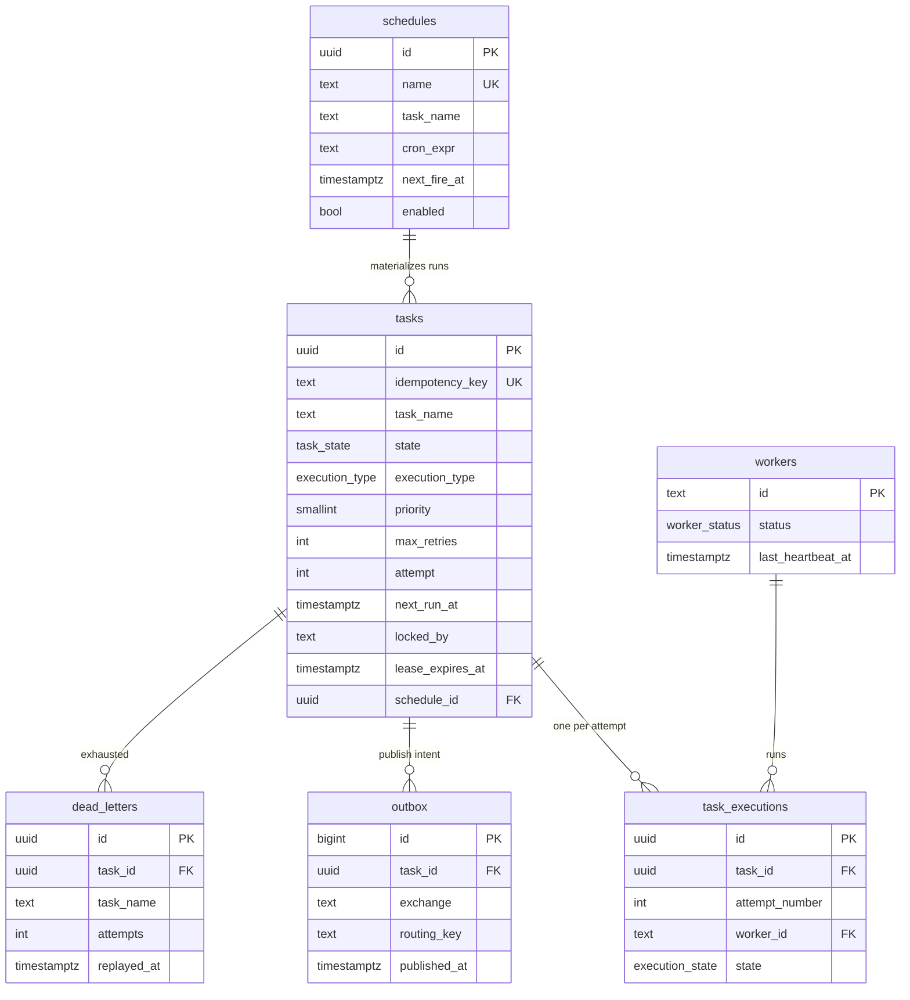

# Database Schema (Phase 1)

PostgreSQL is TaskFloww's **source of truth** (ADR-0001): the task state machine, scheduler
clock, leases, retry accounting, cron definitions, and the transactional outbox all live here.
Migrations are in [`../migrations`](../migrations) (goose). This doc is the human-readable map.

## Entity relationships



## Tables

| Table | Purpose | Written by |
|---|---|---|
| **tasks** | Central state machine + scheduler unit. One row = one runnable task (immediate / delayed / a materialized recurring run). | API (submit), dispatcher (lease), consumer (terminal state), reaper (re-queue) |
| **schedules** | Recurring **definitions** (cron). The scheduler materializes a `tasks` row per firing → full run history. | API, scheduler |
| **task_executions** | Idempotency ledger + attempt history. Its `id` is the `execution_id` carried in each message. | dispatcher, consumer |
| **workers** | Worker fleet registry + liveness. Worker-level heartbeats (one row/worker). | consumer (from heartbeat messages) |
| **outbox** | Transactional outbox: publish intents written in the same tx as a state change. | dispatcher (write), relay (publish + stamp) |
| **dead_letters** | DLQ introspection + replay. Populated when `attempt > max_retries`. | reaper |

## Task state machine

Required states (spec): **queued, running, completed, failed, retrying**. Operational extras:
**dispatching, dead, cancelled**.

```
                     ┌──────────── cancel ───────────┐
                     ▼                                │
  (submit) ──▶ queued ──▶ dispatching ──▶ running ──▶ completed        (terminal)
                 ▲              │             │
                 │              │             ├─▶ failed                (terminal, non-retryable)
        backoff  │              │             │
              retrying ◀────────┴─────────────┤ (lease expired OR worker reported failure,
                 │                              │  and attempt <= max_retries)
                 └───────── attempt++ ──────────┘
                                                └─▶ dead ──▶ (DLQ)      (attempt > max_retries)
```

- **Enums are native** Postgres types (see `00001_enums_and_functions.sql`) — compact hot-path
  indexes and strong typing in Go via sqlc later. Values mirror
  `orchestrator/internal/domain` one-to-one (guarded by `enums_test.go`).

## Indexing strategy (optimized for frequent state updates)

The spec calls for tables "heavily optimized for frequent state updates". Key choices:

| Index | Predicate | Serves |
|---|---|---|
| `idx_tasks_due` | `WHERE state IN ('queued','retrying')`, key `(priority DESC, next_run_at)` | Dispatcher due-scan; **partial** → only dispatchable rows; key order matches `ORDER BY`. *(Verified used via EXPLAIN.)* |
| `idx_tasks_lease_expiry` | `WHERE state IN ('dispatching','running')`, key `(lease_expires_at)` | Reaper's expired-lease scan |
| `idx_schedules_due` | `WHERE enabled`, key `(next_fire_at)` | Scheduler firing scan |
| `idx_outbox_unpublished` | `WHERE published_at IS NULL` | Relay claim (`FOR UPDATE SKIP LOCKED`) |
| `idx_dead_letters_unreplayed` | `WHERE replayed_at IS NULL` | Operator DLQ listing |
| `uq_task_attempt` | `UNIQUE (task_id, attempt_number)` | **Idempotency** ledger guard |

**Why partial indexes:** they contain only the rows the hot loops care about, so they stay tiny
and cache-resident even as completed/dead rows accumulate — and they shrink automatically as rows
leave the working set.

**Storage tuning:** `tasks` uses `fillfactor=85` and `workers` `fillfactor=70` so frequent
`UPDATE`s can place new tuple versions on the same page (less index/heap bloat). `tasks` can be
tuned lower under heavy write load. Note: because state-change updates touch indexed columns they
are not HOT; fillfactor still reduces page splits. A future option is to split the very hot
lease/heartbeat columns into a narrow side table.

## Design decisions & refinements

- **Two identifiers on `tasks`:** internal `id` (UUID surrogate for FKs) + client-supplied
  `idempotency_key` (`UNIQUE`) — the spec's "unique id" — which **dedupes duplicate submissions**.
- **Recurring = definition + runs:** a `schedules` row is the cron rule; each firing inserts a
  concrete `tasks` row (`execution_type='recurring'`, `schedule_id` set, guarded by
  `chk_recurring_has_schedule`). This preserves run history instead of mutating one row forever.
- **Worker-level heartbeats:** heartbeats update one `workers` row, not every in-flight task —
  far fewer writes. Per-task `lease_expires_at` is the backstop for a task claimed but never run.
- **Outbox is written at _dispatch_, not submit** (refinement of the early PLAN.md wording): the
  atomic unit is "transition task → dispatching AND enqueue publish". Delayed/recurring tasks wait
  in `queued` with a future `next_run_at` and produce no outbox row until due.
- **DLQ is hybrid:** RabbitMQ's native DLX physically dead-letters; `dead_letters` mirrors it for
  querying and replay.

## Validation performed (Phase 1)

Ran against a throwaway PostgreSQL 16 cluster: `goose up` (v0→v7) and `goose reset` (v7→v0) both
clean with **no leftover tables/types**; verified partial-index predicates, fillfactor,
constraints, and `updated_at` triggers; functional checks confirmed idempotency dedup, the
recurring/priority CHECKs, trigger firing, and that the dispatcher query uses `idx_tasks_due`.
